It’s all about Processes
Software development is controlled and governed by a vast number of processes. These processes focus on one question: "How things should work". Processes can be diverse, from simple to complex, done continuously or occasionally, manually or fully automatic.  90% of all tasks DevOps engineers will deal with, such as operation, security, monitoring, will not have a real impact on the software development business. They are needed because reality changes and processes are imperfect. DevOps engineers can make a real impact on the software development business by designing and optimizing processes. Processes are the way to reconcile all parts of software development into a well-orchestrated piece. In a word where everything is code, application is code, infrastructure is code, and processes are code too.

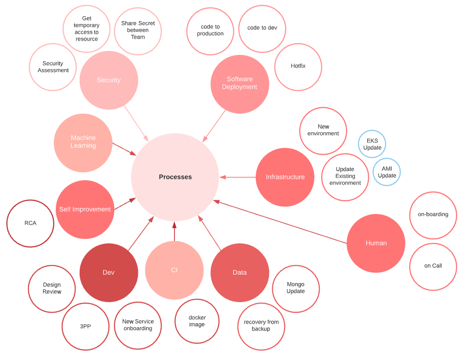
 

## Make your Processes As First Citizen
Modern software development has made microservice the king of the ring. What people know less is that the processes are the queen. The queen has the power; she is the most powerful piece on the board.  The non-recognition of processes as first citizens and belittling them to simple automation leads to poor, ineffective software development business.

## RCA & Processes Relationship
Root Cause Analyses (RCA), the post-mortem examination done after any production incidence, focuses on two questions 1) Why has it happened and 2) What should we do to prevent it from happening again. A quick analysis of RCAs (about 40) my group was involved in during the past three years has shown that 45% were caused by missing or not well-defined processes. 

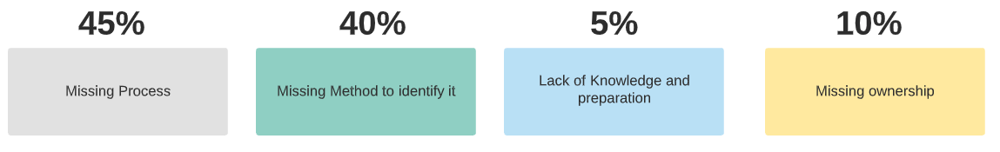

## DevOps as a business analyst with many technical skills
There is a misleading perception about the essential aptitude and expertise expected from DevOps engineers, and this is reflected in the job descriptions of new positions, being very often a long list of technical skills and missing the point that a DevOps engineer is essentially a business analyst, who guides businesses in improving processes, products, and software through data analysis. His role is to serve as a bridge between business problems and technology solutions.

## Bridging the gap between mentalities
DevOps is all about process fluidity, and fluidity is not only about code, machine, or automation but is also a human challenge. Most processes are cross-teams, cross-mentality, and cross-ego. DevOps’s role is to bridge the gap between people from development, infrastructure, security, and product. DevOps’s role is to break down artificial barriers, the “silo mentality”, the resistance to change, and to convince people to lose their control, redistribute responsibilities in a scalable way, and work together as a virtual team towards a common goal.

 
[credits](https://unsplash.com/photos/7kSnMLGoR9w)

## Tools are not the way to talk about processes
Don’t be trapped or distracted by tools. They are part of the solution, but they should not shadow the process itself and, in particular, its requirements. Requirements represent an ideal and the design a compromise. Many tools make assumptions and are opinionated, which could be fine, but make it clear why you make these compromises.

 
[credits](https://unsplash.com/photos/NL_DF0Klepc)

## Understand requirements
Developers tend to write code without design and write design documents without complete requirements. Processes make no exception. You cannot start modeling processes without a full understanding of their requirements. What are the objectives of the process? For whom is it created? What are the input and the output? Who is responsible for the process? Who are the actors? What are the constraints and dependencies? And last but not least is what its performance indicators are? 

## Performance indicators
Are measures that evaluate the success of a given process. Performance indicators try to answer “Is the process objective achieved?”.  Having processes without a well-defined performance indicator is like having an electric plate with a broken tag. Is it on or off? Is it low or high? Its definition is purely a business matter. For example, if we talk about the CI process, its indicator could be based on the average CI cycle time with the average time for jobs in the queue.

 
[credits](https://unsplash.com/photos/0aqJNZ5tVBc)

## Wrong mindset
Two years ago, I redesigned and improved our CI process. I was pretty proud to have reduced the time of the CI cycle to less than 5 minutes. A few months later, developers were complaining (in general in the kitchen, but also in the #devops-help slack channel) that the CI was stuck again. The average time was then 50 minutes. What happened? The number of applications was quadrupled, and many slow integration tests were added. If you don’t have real-time performance indicators part of your dashboard, you cannot be responsive to change. The last thing you want is that your “customers'' become your performance indicator. The root cause of this story was not the missing performance indicator but a wrong mindset on what I was working on.

## Process #1 "From Code to Development Environments" 
It could be very challenging for developers to test their code in a real environment. This challenge can be explained by the fact that modern applications generally deploy a large number of services, and these services are tightly integrated into the cloud provider ecosystem, making it practically difficult to run on a  local computer. The “from code to development environment” process is dedicated entirely to developers. The objective of this process is to make the developers productive by getting on-demand a fully dedicated functional development environment. By neglecting this process, developers will push their code to master either without caring if their code works or in the intention to test it in the staging environment. The hidden objective of this process is to protect the master branch. 

## "Merge to Master" point of no (difficult) return
The merge to production branch represents a key event in the release pipeline. At this particular time, the new code incorporates the mainstream pipeline. It will go through some experiments to validate and eventually continue to production. If, for any reason, this mainstream is compromised by a bug or an undesired side effect, the entire production line is blocked. Fixing it will be difficult, take time, and cost you a lot. Process #1 is the most effective way to prevent your master branch from being dirty. 

 
[credits](https://unsplash.com/photos/QMjCzOGeglA)

## Process #1 Feature branch as the source of truth
To be practical, the "from code to development environment" should be transparent, easy to set up, and as fast as possible.
Any process should aim to be transparent, meaning that the actors don't need to learn new methods or commands and don't have to feel they are part of a more significant thing. Process #1 should use the natural way developers work with code, “Git”. The concept of managing application deployment with Git is not new; it was introduced by Heroku a decade ago.

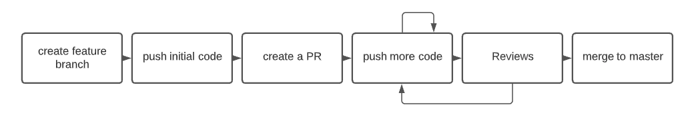 

Making the feature branch the source of truth is the key of process #1. Let's describe how it works. The developer starts by creating a new environment associated with his branch. Each time a new commit is pushed, a new docker image is built and saved to a docker repo. The CD component of the new environment will discover it and deploy it. We should give special attention to making this process as fast as possible, for instance, by optimizing the build cache strategy and postponing any tests after the deployment occurs.

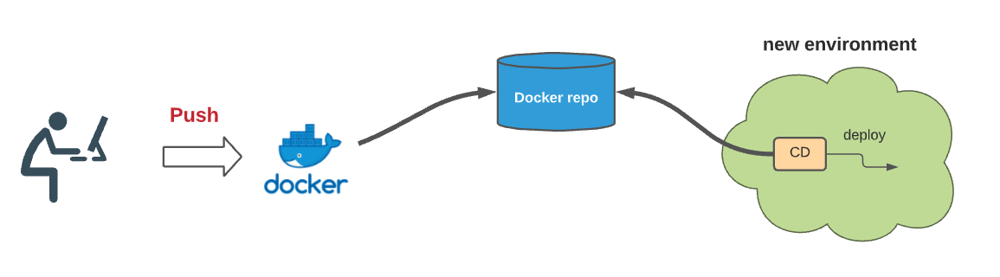 

## Dynamic Environment as a new paradigm
The necessity to create and destroy environments dynamically on the fly is of paramount importance in a modern DevOps-changing world. Having some static development environments shared between developers should not be an option anymore. Here are some reasons why: these environments are generally in catatonic states, they have ownership issues, are under-utilized, cost-ineffective, with old infrastructure, they do not promote immutable infrastructure, and most importantly, connecting them to a feature branch will not be easy (we will see later why). 
Creating new environments on the fly implies three requirements: 1) the adoption of “infrastructure as code”, 2) a way to quickly instantiate and delete new environments, including all the necessary states and other dependencies to be fully functional, and 3) a way to modify the continuous deployment mechanism to deploy from a private branch. 

## Process #1: Environment creation easy setup
To be practical, creating a new environment should be as easy as possible. It could be initiated using a GitHub label or a Slack bot. For example, a developer just types in a Slack channel “create environment us-56782-support-google-login”, a Slack bot will trigger the creation of a new complete environment connected to the branch “us-56782-support-google-login”.

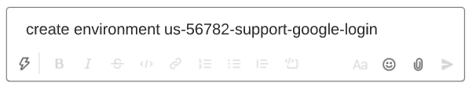 

Each time a developer “push” a change to this feature branch (across all existing services!), process #1 will make sure his change is deployed to his dedicated environment. 
For cost-effectiveness, these environments should have a short lifetime. For example, destruction can be triggered by inactivity in git. (e.g., no push during 6 hours). 

## Model Extension to include all Kinds of Code:
Given developers, the ability to modify their service and deploy it automatically to an ephemeral environment based on a feature branch is an excellent start. But what about the infrastructure code or the CD pipeline code? The following picture tries to extend our previous model. Let’s describe how it works: a developer just types in the slack channel “create us-567850-spike-mongodb 1) if this branch exists in the “infrastructure as code” repo, it is used to create the new ephemeral environment; otherwise, the master branch is used, 2) a pipeline CD component is then injected in the new environment using the same branch if exist or the master if not and 3) all microservices are deployed to the new environment using the pipeline from 2. If a microservice has the same feature branch, it will be used; otherwise, the master will be used.

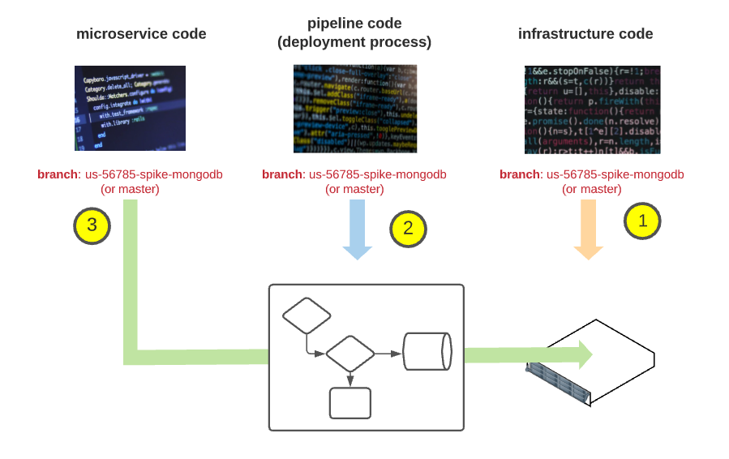 

## Make your codes equal
In the previous section, we dealt with an important concept, “all codes are equal''. There is no fundamental difference between service code, infrastructure as code, or pipeline as code. Like a service that depends on another service, services depend on infrastructure. Having a coherent development model across your entire code, regardless of its nature, helps you rationalize and simplify things. Simplification in the way we develop, test, and deploy. If, on the one hand, you develop and deploy your service through a feature branch strategy, and on the other hand, you have one folder per environment for your terraform code, you increase the complexity of your stack.

 

## Design your architecture up to your ambition
How difficult is it to implement a feature branch as a source of truth? How difficult is it to make your deployment from a branch? It depends on the architecture. Having a centralized (non-scalable) architecture with a single Jenkins/spinnaker instance for all your environments will make it very difficult. On the other hand, adopting a decentralized approach, where each environment is self-organized and contains its CD components based on any branches you want, will make it easy to implement. 

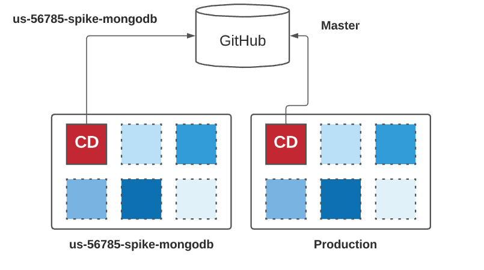 

## Process #2 The release management process: 
Let’s introduce our second process. The “release management process” is considered the primary DevOps process by excellence. Its objective is to create a continuous flow from the master branch to the production environment while minimizing the risk of surprise. This process will keep us busy for some pages.

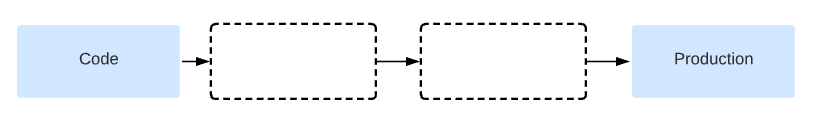 

"Houston, we have a problem": Monday morning, a new version has just been deployed, everything seems to work fine. Suddenly you get a call from the professional service; customers start reporting that the application store is not working anymore. 

 
[credits](https://unsplash.com/photos/loeqHoa1uWY)

The log doesn’t contain any error; The Grafana dashboard indicates very high traffic. Is it related to the issue? Mike, your colleague, tries to understand the differences between the last deployment, where everything was fine. The new deployment includes 80 new pull requests, only a portion of them are related to the store application, but since they use a mono-repo, it will take time to filter them. Forty-five minutes have passed, and the boss is pressing to revert to the previous deployment. Bob is not sure it is a good idea since the new deployment includes a schema change in the database, and the DBA guy is unavailable. Max from the platform team just informed you that the new deployment is also using a new version of Ubuntu and that they also upgraded the docker engine. 

## Working
There is only one definition for working: the software is doing what it is expected to do from an end user’s perspective. DevOps is an empirical science based mainly on experimentation and observation. The way to assess the “working” property is to create an experimental environment identical to the one used by the real users and deploy on it the unknown version. E2E tests can then simulate user scenarios and check that everything works as expected. By writing E2E tests, we ensure that the product contract between the service provider and the customer is respected. E2E tests don’t care about the system’s internal implementation, making, in theory, a good candidate for outsourcing (we will see later why this is not true). E2E tests are the sole measure of working.

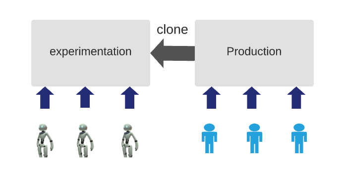 

## Healthy
Healthy is a subjective and relative concept and means “not displaying clinical signs of disease or infection”. When I was an EMT-driver, I was sent to a non-emergency call. When we arrived on the scene, we found an older person breathing heavily, making pressure cooker noise. I immediately asked the dispatcher to send us another ambulance with a medic. I remembered my embarrassment when the doctor arrived and asked him, “since when did you breathe like that?” and his response was “5 years”. The concept of a baseline is essential in DevOps; data are relative and not absolute. The second point is, invest time to find the right key metrics for your services. The third point is also taken from my EMT course, “treat the patient, not the monitor”. Suppose your PostgreSQL instance has a CPU utilization of 90% check the request duration. If it is okay, your patient is fine (for now), then check your baseline.

## Stable
Stable means the application is subject to little influence over time and under (extreme) external conditions. If “working” is proved in a few minutes, “stability” is more subjective and needs more time to be verified. Influence over time is evaluated by creating a new experimental environment and leaving the unknown version for some time while running in loop E2E tests. In addition to the boolean results of E2E tests, it could be valuable to choose relevant indicators and monitor them for degradation.  These measures are repeated using distinct external conditions (load test). The results are then compared and correlated to give an indication of stability. Practically when we introduce a change in the code base, we are looking for a simple answer to “does this change have a negative impact on the performance and the stability of the product?”. Working with small chunks of code makes it easy to identify the responsible.

## “Resilience”
Resilience is the process of adapting in the face of adversity, threats, or significant sources of stress. Practically this means that the application continues to work despite failures or can recover quickly from unexpected events. Resiliency is the elasticity property of your system: nothing is rigid, every component can be stretched, disappear, and return to its normal size. Chaotic engineering is the discipline and practice of causing random failures in a system to assess its resiliency. Chaotic engineering tries to answer “Can we predict the unpredictable?” using simulation. In 2011, Netflix introduced ["Chaos Monkey"](https://netflix.github.io/chaosmonkey/) a tool to randomly terminate instances in production. Beyond the idea of Chaotic engineering, two important DevOps principles are hidden:  1) there is no place for the “unknown” in modern software engineering. Maybe your system is not resilient or has some security issues, but you cannot just ignore them; you must understand their scope and limitations, and 2) don’t be afraid to use your production environment for testing scenarios. Don’t miss the opportunity to do experiments to answer questions like “is it working, is it stable, is it resilient” on the real things: real data, real user, real traffic. This is your last line of defense; use it. 

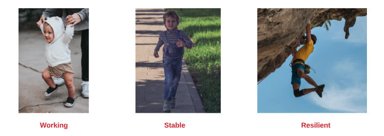 

## Why companies fail in their E2E strategy
Designing and implementing E2E tests can be very challenging. They are expensive to write, run, and maintain, and when failing, they don’t give any indication of why. They generally are spanned by multiple teams, with no motivation to write them, and backup by their management with the fear to “decrease the velocity of the development” thus, their development falls through the cracks and ends up in the best case scenario with a new team dedicated to this job (we will see in a few paragraphs why it cannot be effective). On the other hand, integration tests are developed by service owners. They represent the contract between a given service and the architect and provide an exact answer to “Is this service working?”. They are easier to implement, and in addition, they can be tested (in isolation or not) very early in the continuous release pipeline, making them a key component to the detection of issues as early as possible. Integration tests are essential but have distracted attention from the E2E tests, and many companies have failed to develop a systematic approach to the E2E tests and to answer the question “Is it working?” rely mainly on the additivity property of integration tests.

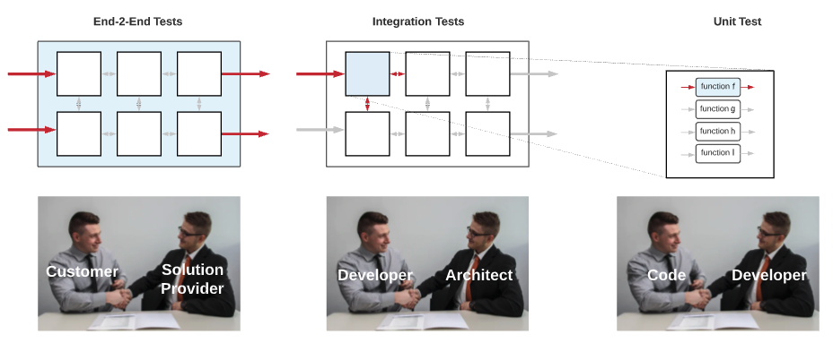 

## There is no replacement for the E2E test
Let’s make an allegory to understand why integration tests cannot replace E2E tests. Suppose a Swiss watch company is building a new watch model. The spare parts are manufactured in their factory in China, and the assembly is carried out in Switzerland (to get the “Made in Switzerland” designation). The watch contains 30 moving parts; most of them are wheels. To minimize the risk of incompatibility, the Swiss headquarter has provided to the factory nine simple compatibility tests to make sure some parts fit well together (see picture below). The tests have been successful; the pieces are then sent to Zurich, where highly specialized workers perform the assembly. Once this assembly is completed, the watch is immediately sold on the internet. Do they check if the watch is working? No! Do they check if the watch doesn't go wrong after a day, a week? No! Do they check if the watch is waterproof? No!. Can integration tests replace E2E tests?

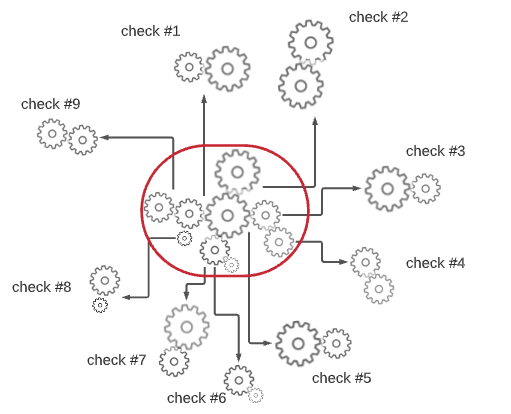 

## Getting to the root of the problem
Why do E2E tests go wrong in practice? Most modern codes are not E2E testable. They are often highly-coupled with some external services (for example, an e-commerce application being coupled with an external payment method that doesn’t let you test it without doing real transactions), or may contain slow processes (for example, some slow queues, offline jobs, or even manual intervention) or they are missing some API essential for the test. For a code to be E2E testable, it should have been designed with E2E testability in mind. It is the same for making secure code.  You cannot make secure code if you don’t have security in mind. Designing E2E tests after code has been written is the root cause of E2E test strategy failure. 

## Making testable code
The approach for creating testable code is to move the responsibility of the E2E tests to the SCRUM team developing the feature. The team will take care of the design and the implementation of these E2E tests, and if needed, will adapt the design of their feature to make their test feasible and fast. The key to success is to realize that application and test design should start together and are tight together. A slight alternative to this method is to have an E2E tests champion in every team. The champion’s responsibility is to ensure that part of the DOD (definition of done) developers have designed an E2E tests plan (without implementing them) and make sure their codes are compatible with the test plan. The test plan could then be outsourced to another team for implementing it.
It may seem weird or even an anti-pattern that tests influence the codes it is testing, but success is the ability to rise above principle.

## Making E2E tests affordable: Removing the UI Layer
Another reason why E2E tests are expensive is that they generally rely on UI. UI tests are unstable, fragile, and break easily. E2E tests are not UI tests; the focus is the flow and not the UI itself. We use the UI because we simulate real users, and users are using the UI, but if there is another simplest way to test the flow without the UI, we are fine. The concept of “API first”, making API a “first-class citizen”, and the UI, a simple consumer, can help us to bypass the UI layer and create a complete E2E flow based on the API layer. Removing the UI from the equation is not ideal by itself; it is a compromise to make E2E tests more affordable and more maintainable.

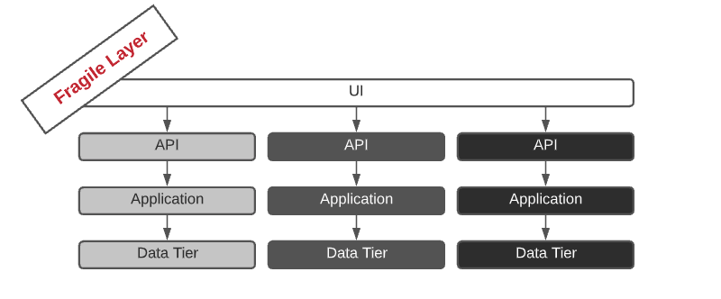 

## Code Review as the last bastion of defense
We talked earlier about the “merge to master” as the point of no return and the importance for developers to test their feature branch in an on-demand environment. These environments can be very effective in checking that new functionalities are working as expected and verifying that the changes made in the codebase don’t affect the overall working functionality (through regression tests).  On the other hand, they are very limited in identifying bugs. Code review is the only way to significantly reduce the number of bugs before entering the production branch. In addition to being the most effective way to identify logical defects, it is also a valuable tool for maintaining code quality standards, education, and sharing knowledge in the team.

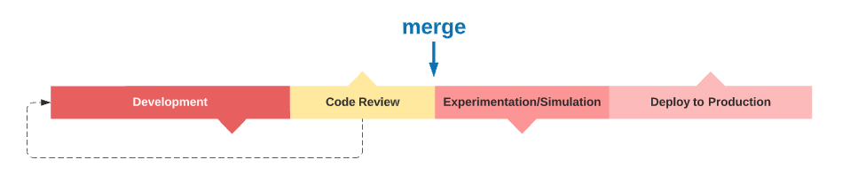 

## Code review starts with yourself 
My father, Claude Cohen z”l (Cairo 1941- Jérusalem 2011), was a medicinal chemist and a pioneer in the “rational drug design” field. In the late 1970s, he wrote many Fortran programs to model the geometry and properties of small molecules. The way to load software into computers was through a “punched card” (see picture below), a piece of paper that holds digital data represented by the presence or absence of holes in predefined positions. 
My father regularly sent his code as “coding sheets” to the IBM center in Paris by taxi. It was a 50-minute trip, where an IBM operator punched the actual deck using a keypunch machine, and the cards were returned to my father. When I asked him about bugs and typo errors, he told me it was infrequent since he carefully reviewed them.

 

## Improving The Code Review Process
Code reviews are suboptimal. Everyone recognizes their importance, but everyone will add it in their new Year’s resolution self-improvement. What’s wrong with it? Like any other self-improvement, if you want to get better at something, you need to know where you stand and a way to quantify your progress, which is missing in today's code review process. We need metrics that will help us to self-improve. Such metrics can be based on the number of reviews done, the time spent on code review (time from the first comment and last comment), etc.
The team retrospective meeting is an excellent framework to review the team scores. This meeting is precisely for that: it is an opportunity for a team to assess its performance and improve itself. Managers should not participate in these retrospective sessions; it will destroy them.

## Why Staging and Production should be and can’t be identical? 
Why staging and production should be and can’t be identical? They should be identical because experimentations done in staging are based on the extrapolation concept. If it is green in staging, it should be green also in production. This extrapolation is correct as the two environments are 100% identical, but this is not the case for two fundamental reasons: data and traffic.
Data in production contains real customer data. These data could not generally be cloned in staging for compliance reasons. Data anonymization is often not doable due to the complex nature of the data, so the staging environment typically ends with synthetic data making the extrapolation less reliable. The second dissimilarity is on traffic, as the production environment is the only one receiving real traffic from customers.

## The problem of environment names
The fact that each environment has a unique name is a source of trouble. If your staging DNS is working, does it imply that your production DNS is OK?
Does the code below seem familiar to you? 

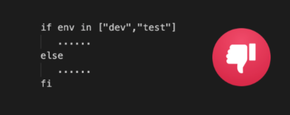 

At first glance, the developer could have a good reason to write it; maybe he tries to minimize the risk in production by gradually rolling out some new process code. But make it clear that this code is an anti-pattern; It is the symptom of an underline DevOps issue. Gradual rolling out should be done only using a “propagation process strategy” (will be presented in a few paragraphs), and if you need to test something in development, do it with a private branch.
Conceptually, giving a name to an environment is in itself an issue. How many times did you recreate your production environment? Probably never, and when it happens, you end up with production2. Giving a name to something makes it permanent, unreplaceable. There is nothing special in the production environment; it should start from scratch regularly. We will discuss in the architecture chapter the concept of keeping the state apart, making the environment completely stateless, and the idea of an ephemeral environment doable. To promote the notion of an ephemeral and idempotent stack, we need to switch from environment name to environment ID and tag. A tag is not permanent and can point to something else.

## Process Modelisation and Implementation
New DevOps engineers start their journey with EKS, terraform, Argo CD and barely understand the chance they have. I have made every single possible errors I can imagine. My first CI/CD process (JenkinsFile) was modeled very similarly to the one shown in the [picture](https://dzone.com/articles/easily-automate-your-cicd-pipeline-with-jenkins-he) below. This image was part of the official Jenkins document (and was recently removed). 

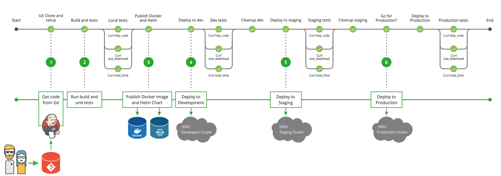 

What's wrong with it? It creates unnecessary coupling between components that are not dependent. Is CD dependent on CI? Is Production dependent on Staging? You cannot easily know what the desired state of the system is. Meaning you can check which version has been deployed in staging or production, but it is generally difficult to know which version will be deployed in the middle of the process.
Let's make a comparison. Let's say there is a company that sells a product. In this company, there are two departments, the manufacturing department (CI) and the sales department (CD). Each department has its own internal processes.

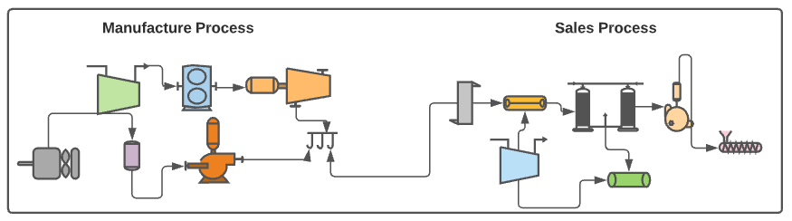 
 
Does it make sense to couple the manufacturing and the sales processes together as we did in the previous Jenkins pipeline?. Does the sales department care about the internal manufacturing processes? If something goes wrong in the manufacturing process, it will block the whole process. The second problem with this coupling is the state. Can you quickly tell what the salesman should sell (the desired state)? It is not an easy task since it is not explicitly defined.  Let's revisit our example, but now we have two distinct pipelines: the manufacturing department and the second for the sales department (yes, exactly decoupling). 

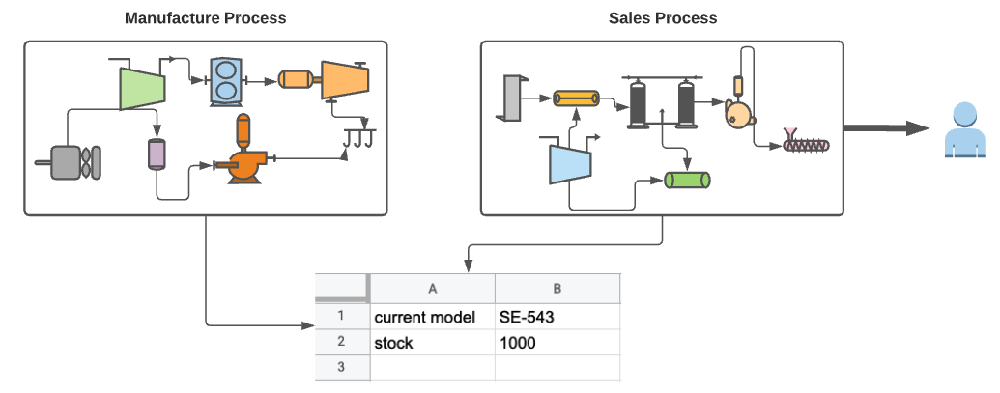 

Since the sales department only cares about these two facts 1) what is the model they need to sell (the version to install), and 2) the availability of the model in the stock (is the new version already in the docker repo?). The last step of the manufacturing process will be to write on a shared google spreadsheet these two pieces of information. The new sales pipeline will now use this information in its own process. The processes are now decoupled, and you know exactly what version you need to sell (the desired state). From the salesman’s perspective, this google spreadsheet represents its source of truth.

## GitOps
if you understand the previous example, you understand GitOps. GitOps is only about decoupling and defining explicit states. The only difference with our last model is instead of using a google spreadsheet as the sole truth, it uses a cloud-based git repository.  Using git as a source of truth is very judicious and smart but is only a detail. It is judicious since it makes things pretty simple: change your code and push it; the developer doesn’t need to learn a new tool. From Git, you get traceability. Using a cloud-based git provider such as GitHub.com is smart since you get access control, ownership management, discussion, approval mechanism, and high availability.

## A more practical Gitops model
The GitOps model based on version only is too simplistic to be helpful. If we examine all the services deployed in a single environment, many of them work together as an independent unit to form a feature or a functionality. Such units are often called functional domains. Functional domains have no direct or little dependency on each other. Consider each “functional domain” being developed by another sub-unit or even company. If you need to talk to another functional domain, it should be similar to the way you connect to an external service. 

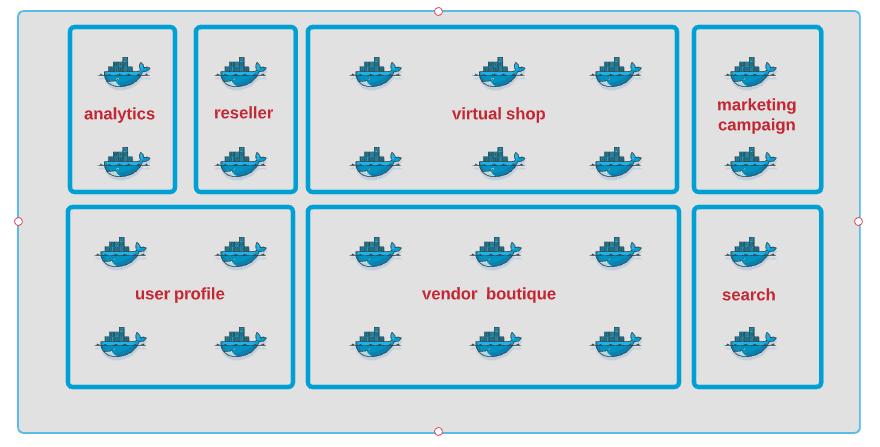 

Incorporating functional domains into our new GitOps model allows us to develop, build,  deploy, and test each FD independently from each other. (when you have a complex situation, your first reflex should always to ask, “Can we decompose it into multiple smaller independent parts?”)
The second abstraction layer needed in our new GitOps model is the packaging layer (or the Helm chart). Deployment of a single service often involves deploying dozens of k8s objects: secrets, volumes, services, pods, config maps, jobs, cron-job. A helm chart is nothing else than an installer program for Kubernetes. In the picture below, all services in the functional domain, FD-1, are deployed through two installers (helm-1 and helm-2). 

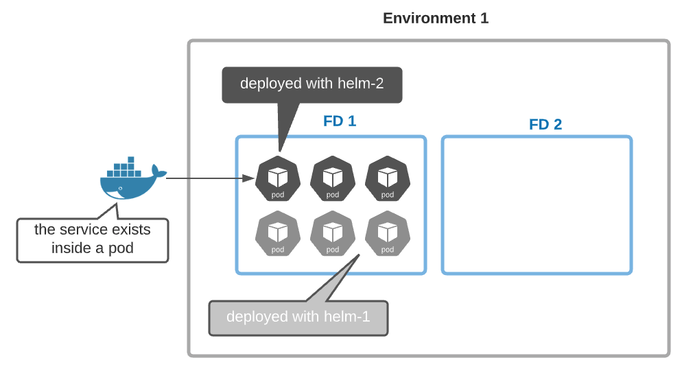 

Let’s now introduce our new GitOps model. Each service has its git repo describing how to build its docker image and a helm repo describing how to install it. In addition, we have the ‘functional-domains’ repo which contains one YAML file per environment. Each YAML file explains how to build all FDs of a specific environment. In the picture below, FD1 is deployed in production using helm chart H1 (release 1.2) and helm chart H2 (release 2.3). 

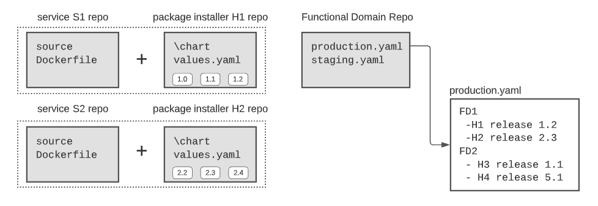 

Service versions are hidden inside the installer package (the Helm chart). So if you make a change to your service, you will have to update your installer (helm chart) too. This inconvenience will be solved using some automated process in the next paragraph.
In our new GitOps model, every environment is connected to its YAML file. A change in any YAML file triggers a change in its associated environment.
The implementation details should consider the decoupling between functional domains, for example, by deploying one argoCD service per FD.

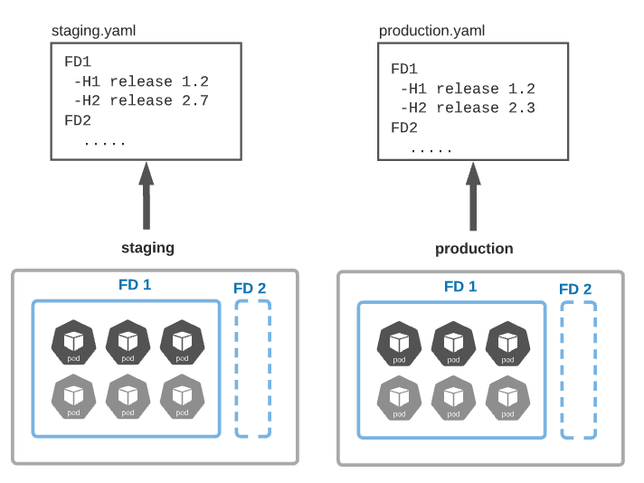 

## Make it Fluid With Automatic Propagation
DevOps is all about process fluidity, and fluidity is translated by the passage of a set of versions of a given FD from one environment to another. Suppose we have a functional domain FD1 in the integration environment set to H1 (1.6) and H2 (2.3), and we have proof that this combination is good in integration. Fluidity means that we want to move this exact combination to the next environment in the chain, which is the staging one. This propagation should be triggered automatically using simple rules or decision gates (see next paragraph). Human intervention should be avoided or at least minimized. Services inside the same FD may have strong dependencies; Moving only a subset of the version validated in a given FD integration could compromise your staging environment.

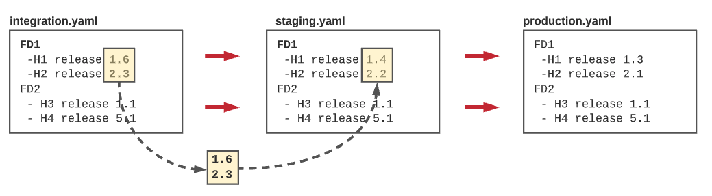 

The fluidity could be modeled using a simple convention. For example, here (in the picture below), we define that for the functional domain, FD1 production is based on staging, and staging is based on integration, and integration is based on the master branch (* indicate a git branch). This simple file defines the routing of our release pipeline.   

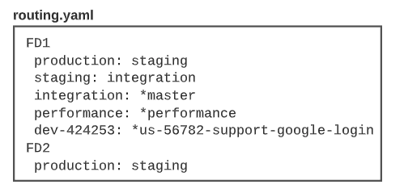 

A developer pushes a change to its service (merge to master), a new release (1.2.3) is created. An automatic process creates a new installer version (helm chart 1.6) for this new release. Since the integration test is based on the master branch, another process updates the “integration.yaml” with the new helm chart version (1.6). The integration environment detects this change and automatically deploys the new helm chart. The new version will propagate to the testing environment when the decision gate of staging authorizes it.  

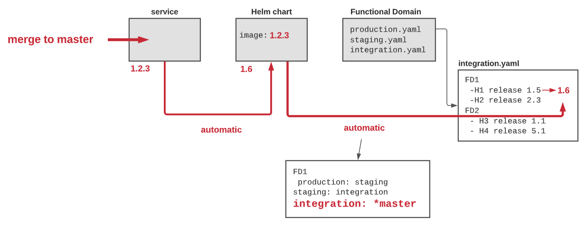 

## Manage your risk by Adding Gates
In the previous paragraph, we have introduced the routing concept to describe how the release pipeline propagates from one environment to another. This propagation is excellent, but we need to control it to be helpful. Decision gates or simply gates are the missing traffic light in these routes. If environments should be identical to each other, decision gates should not. They should reflect the “raison d’etre” of the environment. The closer we get to production, the more we demand in our progress criteria. Conceptually the gate can be viewed as a list of binary criteria to be satisfied to move on. 

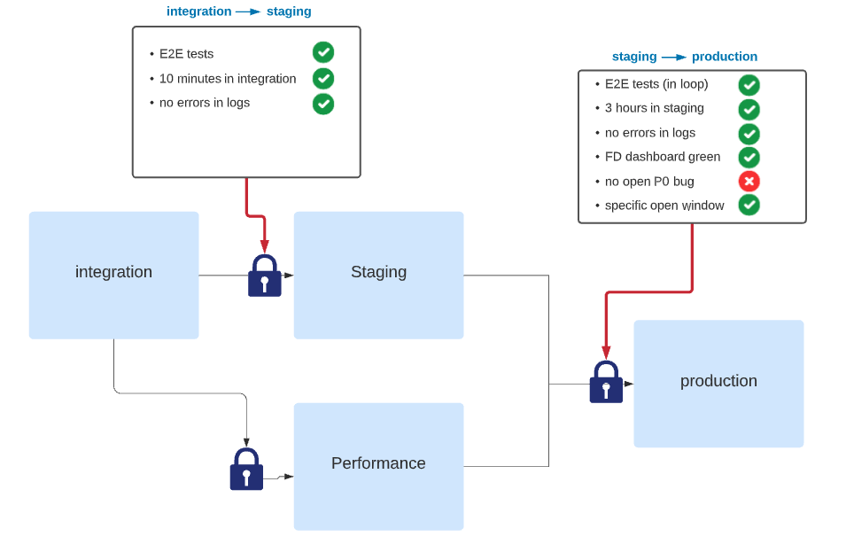 

## Make the fluidity visible
DevOps engineers should deal with process design, process implementation, integration, and less with application code. Retrospectively, most of the code I wrote in the past five years as a DevOps engineer was not 100% justified. I have seen many candidates telling me, “I needed something simple, so I developed it”. We always forget that the cost of a working prototype is only the visible part of the iceberg. DevOps engineers write code because they love it, miss it, and are frustrated with editing YAML files or declarative pipelines.
One of the few exceptions where written application code was justified was to “make the fluidity visible”. I have developed a simple release dashboard that visualizes the fluidity of the different services in the release pipeline. We have found that this dashboard is crucial for maintaining this fluidity and giving visibility to developers.

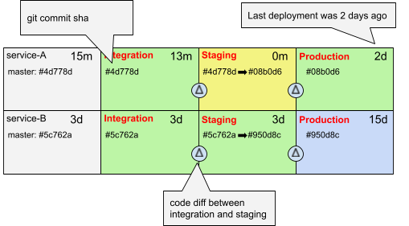 

## Is Fluidity only for Start-Up?
large enterprises spend a lot of effort to maintain and improve their customer’s “trust”. They take their release process super-seriously; nothing is left to chance. Getting production access? Forget about it.  Deploying a new version or a fix in production is a very rigid process using case management, release management, and change management, where changes are recorded, then evaluated, authorized, prioritized, planned, tested, implemented, documented, and reviewed in a controlled and consistent manner. Is fluidity only for start-ups and medium companies? Is the automatic propagation compatible with three releases a year strategy? Can large software companies embrace modern DevOps methodology while maintaining the integrity of their production environment? 
The following picture combines the fluidity mandatory for agility, creativity, and innovation and the trust committed to customers.

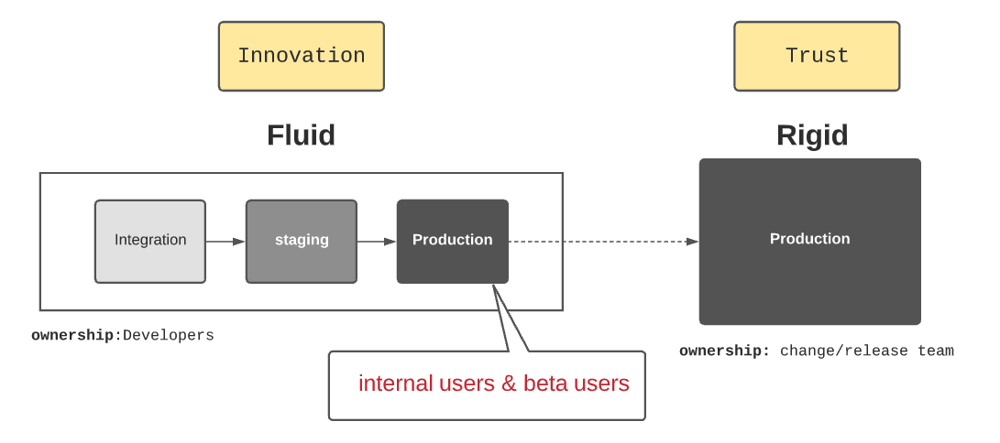 