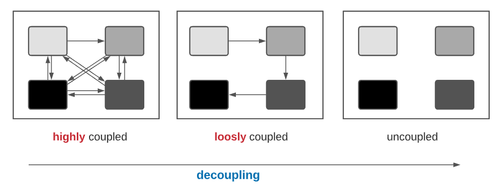
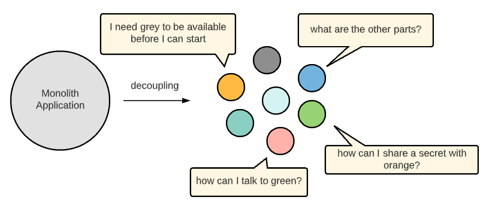
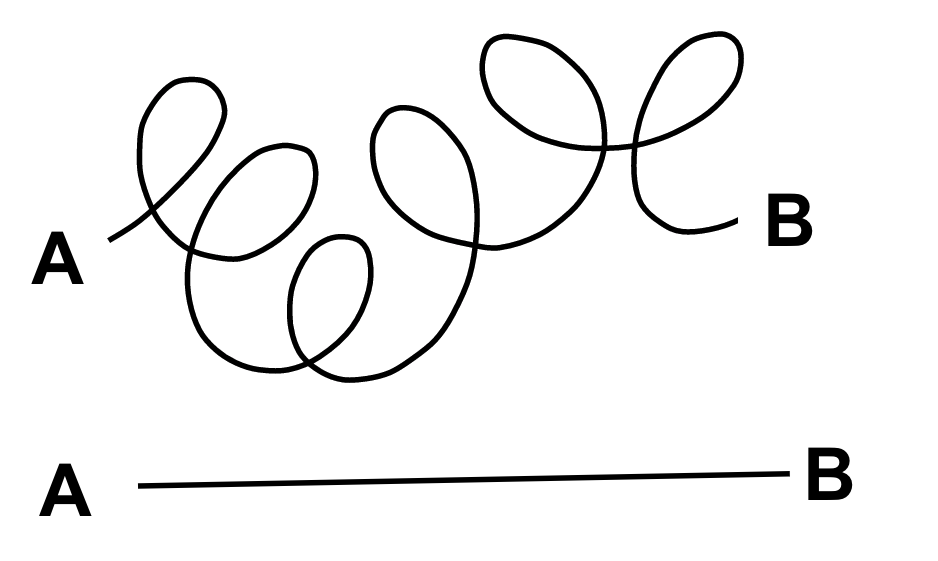
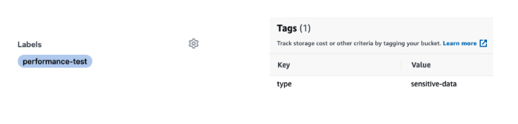

## With Great Power, New Challenges
Cloud providers such as AWS or Google Cloud give us the possibility in a few clicks or with a few lines of code to create complex systems. For example, this [repo](https://github.com/aws-samples/ecs-refarch-cloudformation) will create/deploy in less than 4 minutes: a VPC, 3 private networks, 3 public networks, a NAT gateway, an internet gateway, an ECS cluster with autoscaling and lauchconfiguration, a load balancers with listeners and target groups, and a lambda functions.
Designing and implementing a similar system on an on-premises would undoubtedly have taken several weeks of work. However, these new powers come with new challenges in terms of management, architecture, troubleshooting, compliance, security, and monitoring. Poorly managed DevOps can quickly turn into a nightmare. What are the guidelines and best practices to avoid such a nightmare?

## Striving for simplicity at all layers
the key factor to prevent DevOps from becoming a nightmare is to make simplicity a requirement at all levels.

## Isolate things to their pure essence
What does simplicity mean? I have found this definition extremely well defined "Simplicity is tackling the complexity of the world, and trying to distill (isolate) things to their pure essence."

[credits](https://commons.wikimedia.org/wiki/File:Distillation_(PSF).png)

## Isolating Things
In software engineering, decomposing and isolating components is called decoupling and describes breaking apart highly dependent components into loosely coupled ones. The more tightly coupled these systems are, the more they will be affected by failures on the systems they depend on but more importantly (from a development point of view) the more they will be affected by change in the system they depend on. On the other hand having components that have little knowledge on the other parts of the system is the key for making scalable things.

## The benefit of having simple entities
By having components with simple behavior, each part separately is easier to: build, deploy, test, repair, extend, explain, communicate, share, maintain and operate. 

## The benefit of isolated entities
What are the benefits of isolated entities? In one word: flexibility. Flexibility to: remove unnecessary components, to replace one element with another (for example, by changing its implementation), to scale out one part, to partition ownership in a manageable way, and to restart or update one component without touching the other (having a different life cycle).

## Simplicity doesn’t mean simplistic
It is important not to confuse simplicity with simplistic. Simplicity means decomposing complex problems into several parts. Simplicity doesn’t mean things should not be complex, but such complexity should be modeled in a simple way.

## Decoupling price:
Flexibility is great! But everything comes with a cost, and the cost of the decoupling is high. By decomposing complex components into several simple ones, we increase the system’s overall complexity (law of conservation of energy). Decoupling is the transition from one musician to an orchestra. Still, you can make great music with one musician. In the next paragraph, we will try to understand the challenges of managing an orchestra.

[credits](https://unsplash.com/photos/_r0fD1pDQ38)

## New challenges introduced by the decoupling
The adoption of microservice architecture presents many new challenges. 

- **Communication challenges**: how can different parts communicate with each other?
- **Discovery challenges**: how can parts dynamically discover each other?
- **Dependency challenges**: how to manage dependencies between parts?
- **Versioning challenges**: how do we ensure that nothing breaks when upgrading a part?
- **Operational challenges**: how to monitor & test, individual components, and make sure the whole things is working as - expected,  how can the system continue to work despite the failure of one or more components?
- **Security challenges**: how can we secure the communication or share a secret between components?

Monolith applications don't have any of these problems. The very high entry-level of the microservice approach makes it very questionable in itself.    

## The Lego Era
The decoupling and the microservice adoption don’t represent a goal in themselves?. It’s just the first mandatory step to reach the next phase of the software evolution and revolution: the lego era. The lego era embraces the reuse paradigm, the usage of ready-to-go building blocks at a run-time level: you do your shopping in a supermarket of services: a database, a vault, an authentication service, an authorization service, an automatic DNS registration service, a monitoring service, a logs services, a search engine, a web-server, a proxy. What else do you need?  
The interesting point is that most of the quality attributes used to describe an ideal system, such as: secure, auditable, resilient, scalable, stable, maintainable, flexible, traceable, manageable, portable, reliable, are no more related to your core application. It’s all about the choice of the other building blocks and the way you assemble them. Developers can focus on their core business without wasting time reinventing the wheel or even integrating with third-party libraries. So If we ask the question, “is microservice architecture worth it?” The answer is “you don’t have the choice”. If you take only the first attribute, “secure”, there is no chance to get the “zero trusts” (do not trust anyone inside or outside) easily using some python libraries. 
In the lego era, 90% of the musicians are free; In the lego era, the focus has moved from development to integration. DevOps engineers design complex architecture (Lego Builder) and manage it (Lego manager).

[credits](https://unsplash.com/photos/kn-UmDZQDjM)

The isolation and decoupling paradigm goes beyond microservices and applies to any system organization.  In the next chapter, “It’s all about processes”, we will show how this concept is central to all DevOps processes.

## Doing one thing and doing it well
The “single-responsibility principle” stated for modules and classes which try to encapsulate functionalities into entities that “should have only one reason to change”  has never been so true.  "Do one thing and do it well" is universal. It is true for lawyers, engineers, and doctors too

## Make it simple by Methodologies & Technologies
Decoupling is challenging and requires considerable effort and time. But in recent years, new technologies, abstraction models, approaches, and methodologies have been developed to allow developers to create decoupling architecture predictably without too much effort.  Some examples are given below:

- **Object-Oriented**: decoupling between **interface** and **internal implementation**
- **Microservice**: decoupling between **business components**
- **REST & API First**: decoupling between **frontend** & **backend**
- **Serverless architecture**: decoupling between **code** and **hardware**
- **Message broker**: decoupling between **sender** and the **receiver**
- **Containers (Docker)**: decoupling between **applications** and **infrastructure**
- **Service mesh**: decoupling between the **application layer** and **networking layer**
- **As a service**: decoupling between **my problem** and the **service provider’s problem**
- **The declarative way**: decoupling between **what you want** and **how to do it**
- **The Tagging way**: decoupling between **how** and **who** (will be explained soon)

## Premature Optimization
Simplicity means also focusing on the essential and rejecting the rest (use the word ‘postpone’ outside of your team). Spending time on something not sure is needed is called “premature optimization”. It doesn’t mean we should not deal with potential issues and their possible remediation in a design document but not implement them until these potential issues become real. Bottlenecks are often unpredictable, especially in their intensity. Keep in mind that optimization, even a good one, decreases the readability and maintainability of your code. Homework: In your next planning meeting, try to place “This is optimization, I suggest postponing it”. 

## Maintaining the cause and effect relationship
Causation means that an event (the cause) leads to another event (the effect). An unambiguous way to prove this causation is to design a simple experiment where it is crystal clear that only this cause and no other factors are responsible for the effect.
When writing a unit test and “testing one thing at a time” in isolation (e.g., using mock), you are designing an experiment that tries to prove the relationship between a small unit of code and a small functionality. The isolation is needed to establish that no other factors are responsible for the effect. When you create a new integration environment, you design an experiment that tries to prove some relationship. When you maintain a continuous flow of small changes in your release pipeline, you try to keep the cause to effect relationship true in your process.

## Make it simple by Tagging
Generic and dynamic are better than hard-coded and static, which is precisely what tags give you. Tags are your secret weapon for simplicity. It allows you to decouple your logic from the subjects (on whom do you want to apply the logic).  You can use tags to control access to cloud resources based on your team name or add a tag “sensitive-data” on an s3 bucket to make it disappear from all users. Use a tag (annotation) in your Kubernetes pod to easily retrieve credentials from vault without being vault aware (link). Use Github PR tag (label) to customize your CI process. For example, add a “performance” label to include a performance test on your private branch. Use a tag (reactions) in your slack channel to create a light process using a bot or just to communicate effectively

## Make it simple by consistency
Having consistent methods, processes, tools, tests, dashboards, and naming, improve efficiency, predictability, enhance clarity, lower the learning curve, facilitate onboarding of new people, allow to measure success and progress easier. In the chapter “operation”, we will discuss the facade pattern to make operations consistent. But beyond that, more important than being consistent is the search for consistency.  Why is the deployment of the infrastructure-as-code and the application-code so different? Are they fundamentally different? Searching for consistency promotes and encourages the analysis, comparison, search of common patterns, and asking the right questions, which leads to a deeper understanding, and a willingness to unify, standardize, and make things more coherent and simple.

 
[credits](https://www.pexels.com/photo/city-nature-hotel-building-9038281/)

## Make it simple by conventions
Conventions are all about User eXperience (UX), how easy and efficient the users (mainly developers) interact with processes and tools. Conventions simplify complex processes by making opinionated decisions or by reducing the degree of freedom of a system.  By making decisions on behalf of developers, we keep them on the same path, thus increasing consistency. Because conventions don't have a solid and legitimate basis, it is essential to enforce them. Imagine what it would be if the convention of driving on the right were not reinforced by law? The picture below shows an example of a convention that can ensure developers don’t push code to GitHub without having a valid ticket for their bug or user story.

## Make it simple by making compromises
There are many similarities between “mass casualty incident” and DevOps (I was an EMT volunteer). In both cases, you're dealing with restricted resources and restricted personnel regarding reality. In both cases, prioritization is the key, and you need to stay focused on it. In both cases, you are making compromises and hard decisions. In the chapter “it’s all about agility (how to work smart)”, we will try to understand these priorities. 
Compromise is the art of adapting the requirement to make the design simpler. Compromise is the art of negotiating with your PO or manager and making them understand the consequences of their choice in terms of time and money. If you can use an “as a service” solution and satisfy 80%-90% of your requirements, you have to fight for it! From my experience, even a hard requirement could become soft if you defend it well. Compromise is accepting that the word is imperfect, and you are comfortable with it.